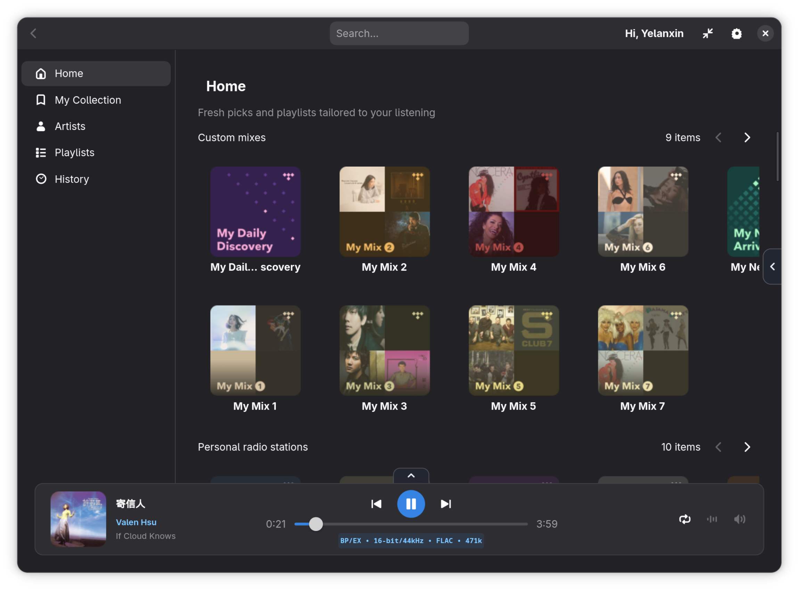
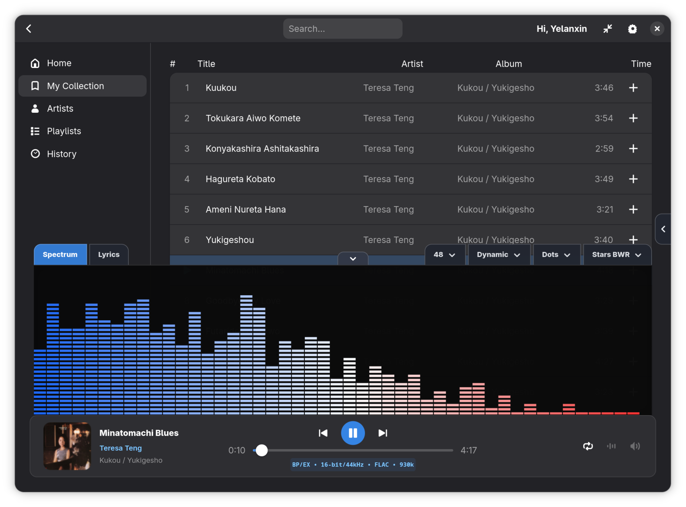
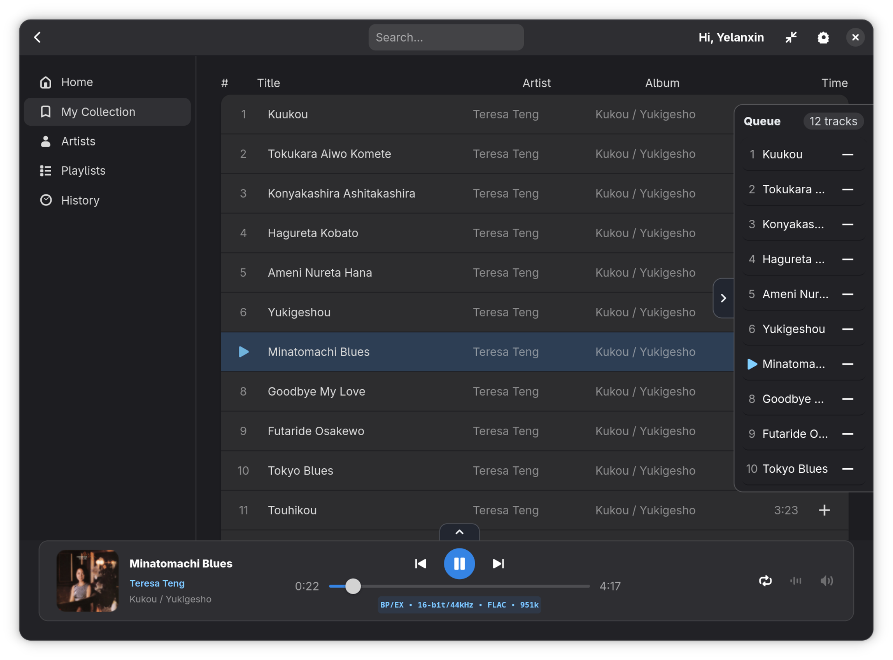
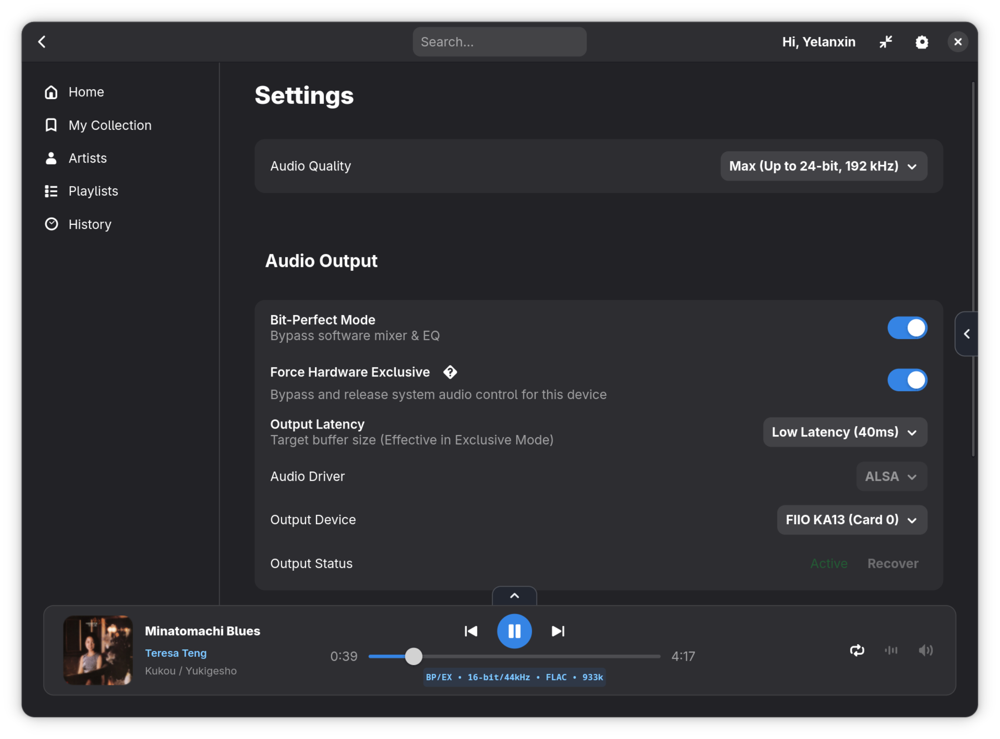

# hiresTI Music Player


Native Linux TIDAL desktop player built with GTK4 + Libadwaita + GStreamer.

- Bit-perfect playback flow
- Exclusive output mode support
- Rich visualizer effects and themes
- Local playlists/history
- TIDAL OAuth login

## Screenshots

Replace the image paths below with your own screenshots.

### Main Window


### Now Playing / Visualizer


### Queue / Playlist


### Settings


### Mini Mode


## Requirements

Runtime (system packages):

- Python 3.10+
- GTK4
- Libadwaita
- GStreamer + good/bad/ugly plugins
- PyGObject bindings

Python packages (bundled in package script):

- tidalapi
- requests
- urllib3
- pystray
- pillow

## Install

### Debian / Ubuntu (DEB)

```bash
sudo dpkg -i hiresti_<version>_all.deb
sudo apt -f install
```

### Fedora (RPM)

```bash
sudo dnf install ./hiresti-<version>-1.fedora.<arch>.rpm
```

### EL9 (Rocky / Alma / RHEL 9)

```bash
sudo dnf install ./hiresti-<version>-1.el9.<arch>.rpm
```

## Build Packages

The project provides one script for DEB and RPM packaging.

```bash
chmod +x package.sh
```

### Build DEB

```bash
./package.sh deb 1.0.4
```

### Build RPM (both Fedora + EL9)

```bash
./package.sh rpm 1.0.4
```

### Build only Fedora RPM

```bash
./package.sh rpm-fedora 1.0.4
```

### Build only EL9 RPM

```bash
./package.sh rpm-el9 1.0.4
```

Output files are generated under `dist/`.

## Run From Source

```bash
python3 main.py
```

## Project Structure

- `main.py`: app lifecycle and orchestration
- `ui/`: GTK widget builders
- `actions/`: UI and playback actions
- `visualizer.py`: spectrum effects/themes
- `audio_player.py`: playback + output control
- `models.py`: local history/playlists storage
- `package.sh`: DEB/RPM build script

## Notes

- Local data is stored under `~/.cache/hiresti`.
- History and playlists are account-scoped after login (per TIDAL user id).

## License

MIT
