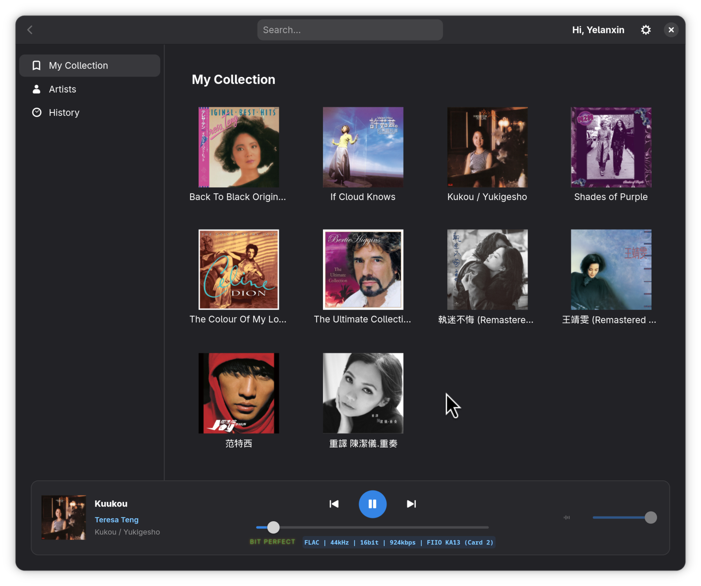
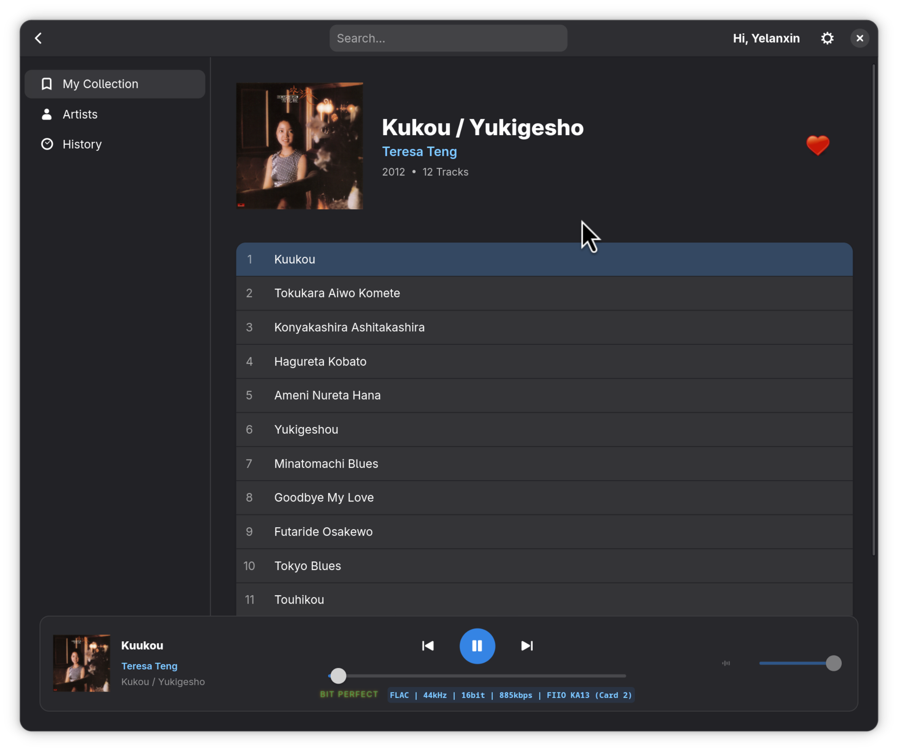
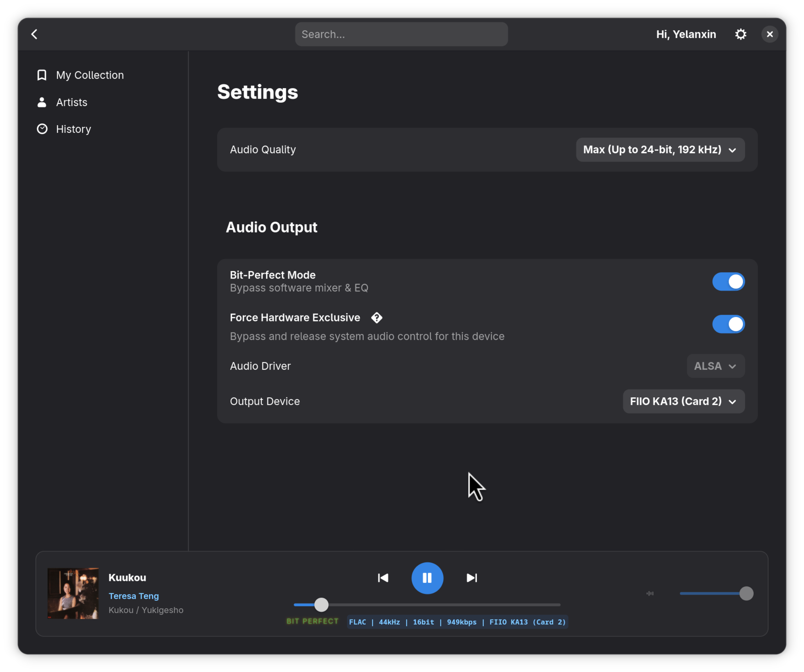

# hiresTI Music Player | [中文](README_CN.md)


**hiresTI** is a modern, high-fidelity TIDAL client for Linux, built with **GTK4**, **Libadwaita**, and **GStreamer**. 

Designed for audiophiles, it prioritizes sound quality above all else, featuring a dedicated **Bit-Perfect Mode** and **Hardware Exclusive Locking** to bypass the OS mixer and deliver pure, unaltered audio to your DAC.



## ✨ Key Features

* **🎧 Audiophile-Grade Audio Engine**
    * **Bit-Perfect Playback**: Automatically switches your DAC's sample rate to match the source track (44.1kHz, 96kHz, etc.) using PipeWire metadata.
    * **Hardware Exclusive Mode**: Completely bypasses the system sound server (PulseAudio/PipeWire) and locks the ALSA hardware device for the purest signal path.
    * **Glowing "BIT PERFECT" Indicator**: Visual confirmation when the audio path is uncompromised.
    * **10-Band Equalizer**: Built-in DSP for sound tuning (automatically disabled in Bit-Perfect mode).

* **🎨 Modern Linux UI**
    * Native **GTK4 + Libadwaita** interface that feels right at home on GNOME/Fedora/Ubuntu.
    * **HiDPI Support**: Crisp, high-resolution album art rendering.
    * **Adaptive Player Bar**: Three-line layout (Title, Artist, Album) with a floating, translucent glass-morphism effect.
    * **Interactive Elements**: Clickable artist names, hover effects, and animated favorite (heart) icons.

* **🚀 Tidal Integration**
    * **OAuth Login**: Secure login via the official Tidal web flow.
    * **Master/Hi-Res Support**: Supports FLAC streaming up to 24-bit/192kHz.
    * **My Collection**: Access your Playlists, Favorite Artists, and Albums.
    * **Search**: Unified search for Artists, Albums, and Tracks.

## 📸 Screenshots

| Album Detail | Setting |
|:---:|:---:|
|  |  |

## 🛠️ Installation

We provide pre-built packages for major Linux distributions. No need to manually install Python libraries!

### 🐧 Debian / Ubuntu / Linux Mint / Deepin 
Download the latest `.deb or .rpm` release from the [Releases Page](../../releases).

```bash
# Install the package
sudo dpkg -i hiresti_1.0.0_all.deg
```

### 🎩 Fedora / RedHat / CentOS / openSUSE
```bash
# Install with dnf (recommended handles dependencies automatically)
sudo dnf install ./hiresti-1.0.0-1.x86_64.rpm
```
